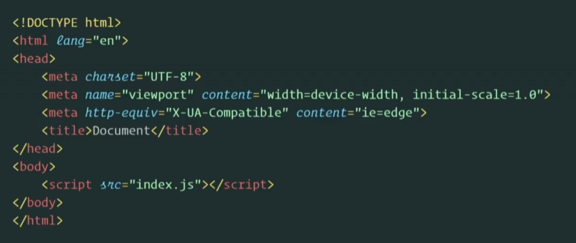
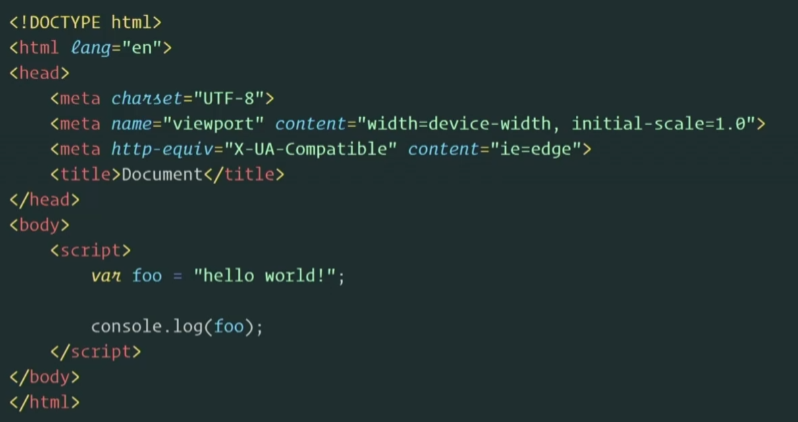
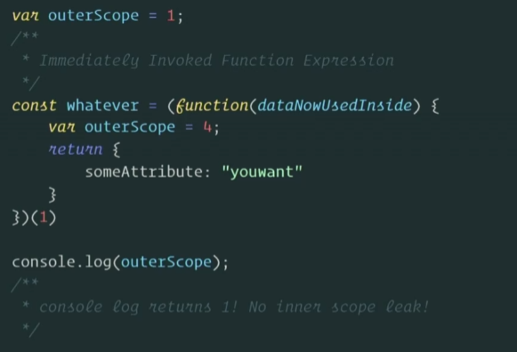
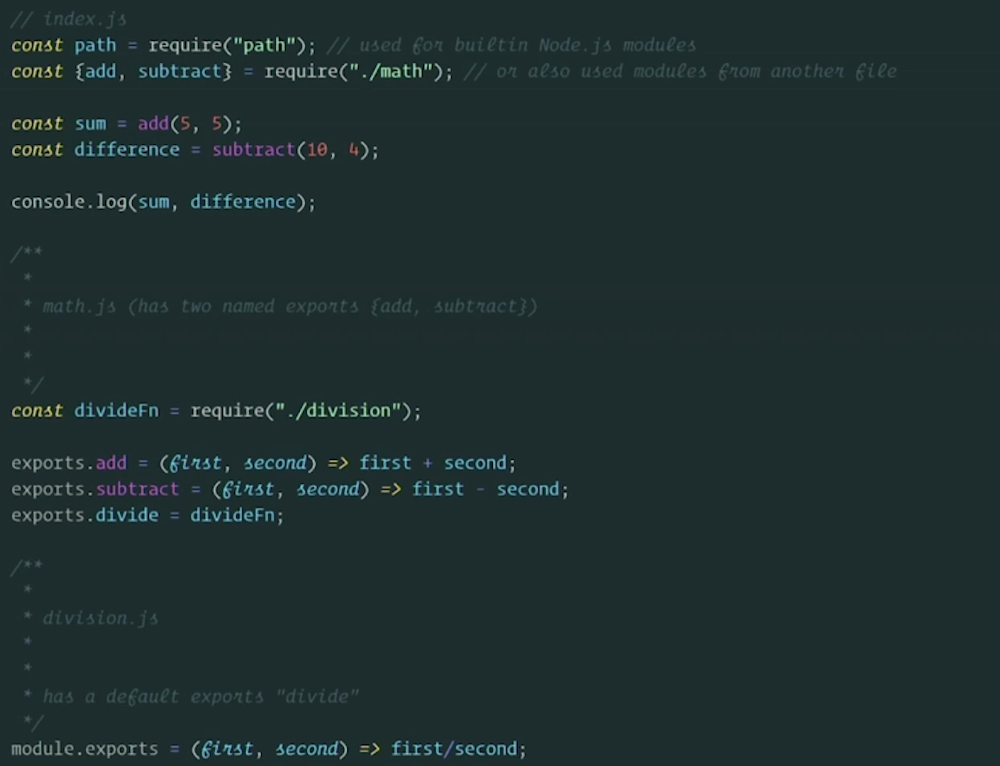

# 一.为什么要选择 Webpack

## 1.1 加载 Javascript 的俩种方式

- 添加`<script>`标签在 HTML 文件，为 JavaScript 文件添加 reference

- 在`<script>`中直接书写

## 1.2 加载 Js 资源存在的问题

一个大型 Web App 会有成千上万个模块，如果通过上述引入`<script>` tag 的方式引入，那么你需要成千上万行的`<script>` 标签来引入这些模块。由于模块直接存在相互引用的关系，那么你必须将被引用的模块放在上方去加载。

在成千上万个模块并且存在引用关系时，手动一个一个通过`<script>`标签引入的方式就会存在很大的隐患，不仅不好维护，也无法决定哪些模块要先进行加载。

## 1.3 解决方案

在 webpack 中是通过 IIFE 也就是我们常说的立即执行函数来进行模块化的

# 二. 模块化的历史

## 2.1 modules 1.0

node 推出了 common.js，你可以像下面这样使用

### (1).node + npm + modules

这是 JavaScript 开始爆发式增长的阶段，node 推出了 npm 的系统，在 npm system 下，你只需要下载你所需要的包就可以工作。npm 创建了仓库并可以进行分享和供他人使用。CommonJs node modules 提供了一个完整的 JavaScript 生态

### (2). 存在问题

问题一：No browser support

CommonJs 存在的问题：它是无法在浏览器环境下运行的，

问题二：No live bindings

在 CommonJS 中，整个 export 对象在 export 时被复制。这意味着 export 的任何值（如数字）都是副本。这意味着如果导出模块稍后更改该值，则导入模块并不会看到该更改。

相比之下，ES 模块使用叫做动态绑定（live bindings）的东西。两个模块都指向内存中的相同位置。这意味着当导出模块更改一个值时，该更改将反映在导入模块中。
