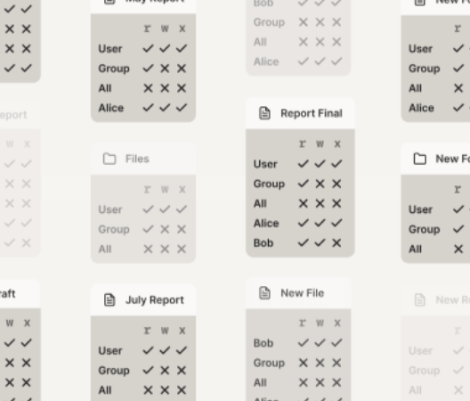

# 一. 什么是 RBAC

RBAC（Role-Based Access Control）即基于角色的权限控制。通过角色关联用户，角色关联权限的方式赋予用户权限。
RBAC 的核心是角色。在 Demo 项目中的权限控制是直接给用户分配权限的，这样少了角色这一层关系，扩展性弱，适合一些用户数量少并且角色类型少的平台。
批量的用户权限修改可以通过修改角色权限来做到。


RBAC 有三个主要原则：

- Role assignment: A subject can exercise a permission only if the subject has selected or been assigned a role.
- Role authorization: A subject's active role must be authorized for the subject. With rule 1 above, this rule ensures that users can take on only roles for which they are authorized.
- Permission authorization: A subject can exercise a permission only if the permission is authorized for the subject's active role. With rules 1 and 2, this rule ensures that users can exercise only permissions for which they are authorized.

译：

- 角色分配：一个主体只有在被赋予角色的情况下可以执行权限
- 角色授权：一个主体只能同时激活一个角色。如果一个主体被赋予了多个角色，那么他同时只能激活一个
- 权限认证：一个主体只能执行当前被激活角色的所有权限。

RBAC 中遵循`role hierarchy`的约束，也就是必须有层级结构，上级角色的权力一定是>=下级角色的

RH = Partially ordered Role Hierarchy. RH can also be written: ≥

- A subject can have multiple roles.
- A role can have multiple subjects.
- A role can have many permissions.
- A permission can be assigned to many roles.
- An operation can be assigned to many permissions.
- A permission can be assigned to many operations

其中倒数第二个提到`An operation can be assigned to many permissions.`，operation 在标准的 RBAC 权限模型中是没有被提到的，和 permission 是有一些区别的：

一个 permission 可以拥有多个 operations，operations 例如读、写、更新、删除。

# 二. RBAC 模型的分类

RBAC 模型一共分为了四种，分别是 RBAC0、RBAC1、RBAC2、RBAC3，RBAC0 是所有的基础，是最简单的逻辑，1-2-3 都是对 RBAC0 的升级。

## 2.1 RBAC0 模型

RBAC0 模型是最基础的模型，是所有升级版的基础逻辑，这里面包含了俩种情况：

    ○ 用户和角色多对一。一个用户可以充当一个角色，一个角色可以由多个用户担任。
    ○ 用户和角色多对多。一个用户可以充当多个角色，一个角色可以由多个用户担任。

通常在简单的系统中，也就是人员较少，岗位分工明确的场景下，尽量使用多对一的权限体系。其他情况可以使用多对多的权限体系，来保证系统的可扩张性。

## 2.2 RBAC1 模型

相对于 RBAC0 模型，RBAC1 新增了继承权限 的概念，也就是子角色，即子角色可以继承父角色的所有权限。

相对于 RBAC0 的优势在哪里呢？例如上下级关系，一个部门有经理、主管、专员，他们的权限都是层级递减的，如果采用 RBAC0 模型，那么需要新增或者删减权限的时候就需要给每个角色分别增加或者删除，如果出现失误，就会造成主管拥有经理没有的权限，也就是越位情况。
如果采用 RBAC1 模型，我们可以定义经理的所有权限，然后主管的权限是在经理的权限基础上做删减，这样就可以避免出现越位的失误情况。


## 2.3 RBAC2 模型

基于 RBAC0 模型，增加了对角色的一些限制：角色互斥、基数约束、先决条件角色等。

    ○ 角色互斥：同一用户不能分配到一组互斥角色集合中的多个角色，互斥角色是指权限互相制约的两个角色。案例：财务系统中一个用户不能同时被指派给会计角色和审计员角色。
    ○ 基数约束：一个角色被分配的用户数量受限，它指的是有多少用户能拥有这个角色。例如：一个角色专门为公司CEO创建的，那这个角色的数量是有限的。
    ○ 先决条件角色：指要想获得较高的权限，要首先拥有低一级的权限。例如：先有副总经理权限，才能有总经理权限。
    ○ 运行时互斥：例如，允许一个用户具有两个角色的成员资格，但在运行中不可同时激活这两个角色。


## 2.4 RBAC3 模型

RBAC3 模型也称为统一模型，也就是 RBAC1 和 RBAC2 的结合模型，包含了 RBAC1 和 RBAC2 的模型特性。

# 三. 理解 RBAC

RBAC 和 ABAC 都源自几十年前的美国军方，可以先了解一下 RBAC 的过程。

## 3.1 DAC(自主访问控制)：各文件 owner 自主设置文件权限

在 DAC 模式下，各个 User 可以设置自己文件的权限。

在 Unix 系统当中，文件可以设置 file permission，例如读、写、更新等。

这种方式中，合规性很难保证，机密文件很容易被恶意 reshare 出去

## 3.2 MAC（强制访问控制）：由专门的 admin 设置权限。

MAC 对 DAC 做了增强。由管理员级别来定制 rules。

在 MAC 模型中，一个人做某些事情的 能力是无法再分享给其他人的，从而避免了文件被 reshare 的问题。

例子：TCP/IP 端口号。当我们占用一个端口后，其他任何人都无法再使用这个端口--不管是什么级别的用户。这里，端口范围不可重叠这一条件，就是强制性的（mandatory）

## 3.2 RBAC

RBAC 我们以 Windows 文件安全模型举例：

在 Windows 中，

- 每个文件（或目录）都有一个 users 和 groups 列表，以及
- 每个列表中的成员可以对这个文件做什么操作。

这是一种访问控制列表（access control list，ACL）。owner 设置 ACL，操作系 统执行 ACL。这是 MAC 模式。但如果由文件读写权限的人，复制一份副本，然后设置他的读写权限，这又是一种 DAC 模式，或者说是一种存在漏洞的 MAC。

ACL 的语义可以由很多，以 RBAC 举例：

- User：在这个文件上执行操作的用户。在经典 RBAC 术语中，称为 subject。
- Group 或 Role：由管理员定义的一组 user。
- File：需要做访问控制的资源（resource）。也称为 object。subject 对 object 进行操作。
- Permission 或 Entitlement： 一条 subject-action-object（用户-动作-目标文件）规则。 有时会说某个 subject 有一条 entitlement，或者说某个 object 允许某个 permission，这两种表达方式本质上是一样的，只是从不同的角度描述。
- ACL：一个 entitlements 列表。

## 3.3 路由权限中的 RBAC

在路由权限管理中，我们通过登录可以得知用户所属的角色。角色可以访问的所有路由地址是一个 ACL，前端可以根据 ACL 列表来清洗和筛选出可访问路由。以此可以来实现菜单细粒度的鉴权。在这个例子中涉及到了 RBAC 模型中的 Roles（角色）- Users（用户） - Permissions（权限）。

菜单下按钮的鉴权也可以通过相同的道理来完成：增加一组 ACL 策略，也就是 RH 规则下提到的：An operation can be assigned to many permissions。

通过这种方式解决的按钮级鉴权存在的问题：每一个菜单路由下都有一组自己的 ACL，这个 ACL 可以由 admin（在这里也就是开发人员来设定），本质上就是一种 MAC 模式。

### 存在的问题：ACL 太多，到处重复，批量修改麻烦

倘若有这样一种场景：

有俩个菜单分别是`/route1` 和`/route2`，俩个菜单下都存在相同的功能按钮，这种场景 `route2` 的按钮可能会是一个便捷入口。这时候如果需要修改角色下的按钮权限，你需要找到 route1 下的 ACL 并修改，然后找到 `route2` 下的 ACL 修改。这已经非常麻烦并且容易出错了，如果 100 个菜单下需要做这些事情，那么你需要逐个找到对应的菜单来修改 ACL 按钮权限。

在文件系统中，上述问题可以用下图表示



例子：三种角色：DevOps（研发运维人员）、Engineering（工程师）、Executive（高管）。

```javascript

{
  "button1-addUser": {
    "disable":"DevOps","Engineering"
    "able": "Executive"
  }
  "button2-read": {
    "able": "Executive", "DevOps", "Engineering"
  }
  "button1-write": {
    "disable":"DevOps",
    "able": "Executive","Engineering"
  }
}
```

### 如何解决：提取 ACL

上述以 button type 来区分后， ACL 分布在各处不好维护。在 RBAC 模型的基础上，我们可以多增加一个 operations 层来统一管理 ACL。

上面的例子我们以 button type 做控制，下面我们以 user type 来控制。

通过 roles->permissions->operations

```javascript

{
  "DevOps": {
    "permission": {},
    "operations": ["routes1-addUser","routes2-read"]
  }，
  "Executive": {
    "permission": {}
  }，
  "Engineering": {
    "permission": {},
    "operations": ["routes2-read"]
  }
}
```

## 思考：

在上面的 RBAC 路由权限中，以 button type 区分和以 user type 区分会有截然不同的效果，又例如在 Windows 文件安全系统中，以 file type 区分还是以 user type 来区分不同的 group 也会有截然不同的效果。

不同场景下需要正确地围绕 users、roles、object types、policies 这些概念设计你的模型，就能避免大量问题。

本文参考：[RBAC like it was meant to be](https://tailscale.com/blog/rbac-like-it-was-meant-to-be/)
